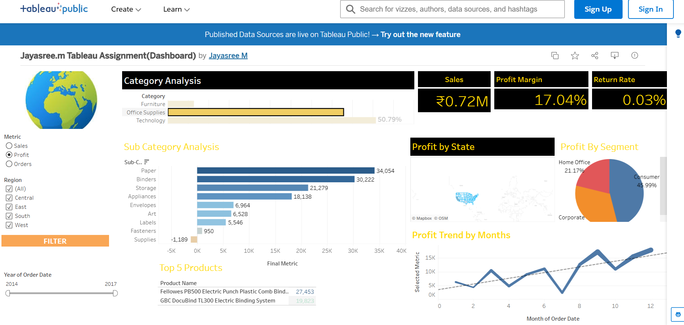

# 📊 Tableau - Retail Profit Analysis Dashboard

### 🔗 Live Interactive Dashboard: [👉 Click Here to View on Tableau Public](https://public.tableau.com/app/profile/jayasree.m1142/viz/Jayasree_mTableauAssignmentDashboard/FinalDashboard?publish=yes)

### 📌 Project Overview
Analyzed Superstore Sales data (2014-2017) to identify profit drivers by Category, State, Customer Segment and monthly trends. Built fully interactive dashboard with Region & Year filters for dynamic analysis.

### 📈 Key KPIs Tracked
- **Total Sales:** ₹0.72M
- **Profit Margin:** 17.04%
- **Return Rate:** 0.03%

### 💡 Key Insights
- **Office Supplies** contributes 50.79% of total profit - Top Category
- **Paper** is top Sub-Category with ₹34K profit
- **Consumer Segment** drives 45.99% profit
- Monthly profit shows clear upward trend from Month 1 to 12
- Top Product: Fellowes PB500

### 🛠️ Tools & Visuals Used
Tableau Public | Filled Map (State Profit) | Pie Charts | Donut Chart | Bar Chart | Line Trend | KPI Cards

### 📸 Dashboard Preview

---
**Created by:** Jayasree M | Tools: Tableau Public
